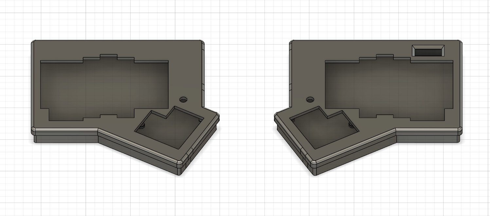
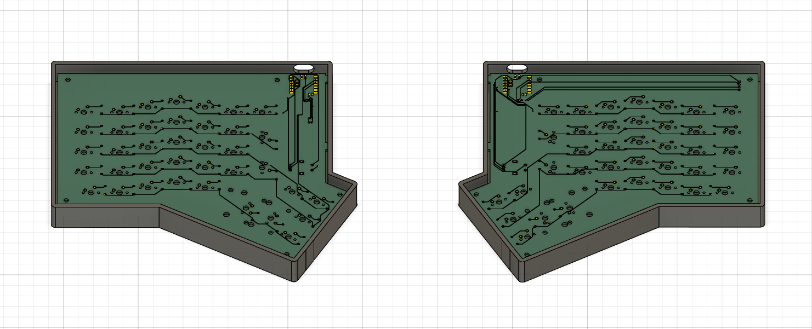
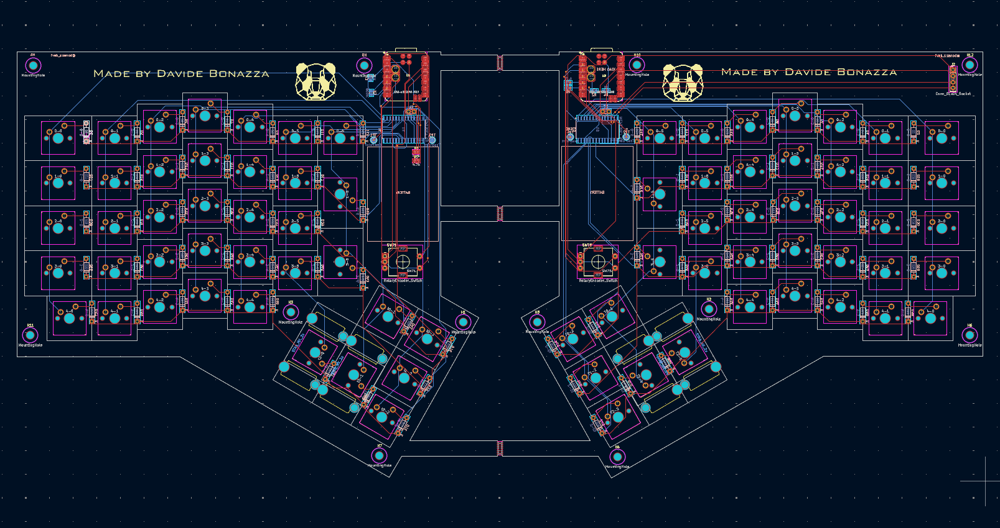
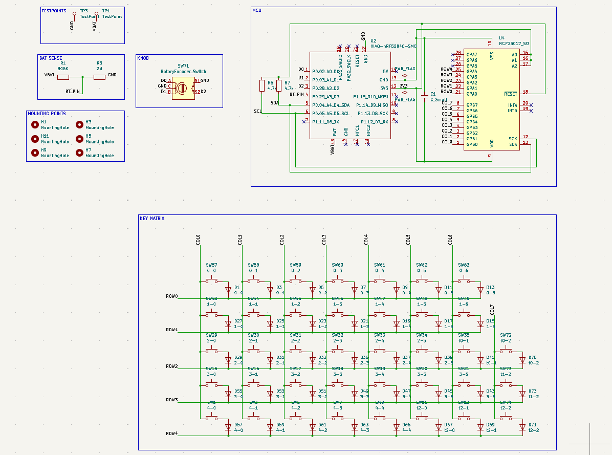
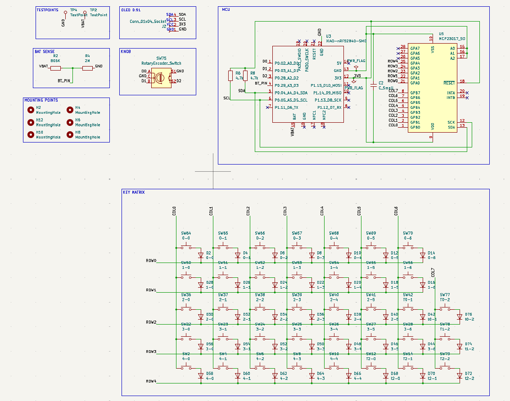

# TwinPanda
 Custom Split Wireless Keyboard (nRF52840)
 Un progetto di tastiera meccanica split custom, progettata per essere compatta, ergonomica e completamente wireless grazie alla tecnologia Bluetooth.
 Caratteristiche Principali
 Cervello: Basata su Seeed Studio XIAO nRF52840, ideale per un basso consumo energetico e connettività Bluetooth integrata.
 Espansione I/O: Utilizzo di un chip MCP23017 (SSOP-28) per gestire la matrice dei tasti tramite protocollo $I^2C$.
 Layout Ergonomico: Layout split da 76 tasti ottimizzato per il comfort.
 Case Custom: Progettato in Fusion 360 per essere stampato in 3D con un top frame da 4.5 mm e inserti filettati M3 per la massima solidità.
 Gestione Batteria: Circuito di Battery Sense integrato per il monitoraggio in tempo reale della carica tramite partitore di tensione ($820k\Ohm / 2M\Ohm$).
 
Case:

PCB:

PCB Design:

Left Schematic:

Right Schematic:

